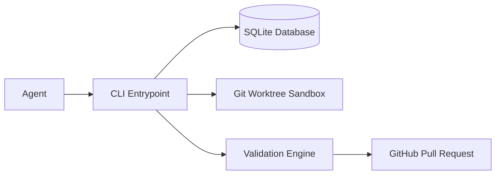

# Architecture

## Direction
cli

## What This Project Is
decapod is a CLI control-plane governance tool built using Rust.
It operates as a daemonless local coordinator, providing state tracking, validation gates, and sandbox environments for coding agents.

## Current Facts
- Runtime/languages: Rust
- Detected surfaces/framework hints: cargo CLI
- Product type: cli

## Topology

## Execution Path
- **CLI Ingress**: Parsed in `src/cli.rs` and dispatched in `src/lib.rs`.
- **Session Authentication**: Active `DECAPOD_SESSION_PASSWORD` validation.
- **SQLite Operation**: Claims or completed logs saved in `.decapod/data/`.
- **Worktree Hook**: Branch setup and isolated execution in `.decapod/workspaces/`.

## Concurrency and Runtime Model
- **Execution model**: Synchronous single-threaded CLI commands.
- **Isolation boundaries**: Process boundaries for each command execution; directory and Git-branch sandboxes for the active workspaces.
- **Backpressure strategy**: Sqlite transaction retry-loop with random jitter backoff.
- **Shared state synchronization**: SQLite write-ahead-logging (WAL) and file locking.

## Deployment Topology
- **Runtime units**: Single cargo-compiled static binary.
- **Region/zone model**: Local developer machine or CI container.

## Data and Contracts
- **Inbound contracts**: CLI subcommands and JSON-RPC payloads.
- **Outbound dependencies**: Local Git command-line client, local Docker daemon.
- **Schema evolution**: Linear SQLite migrations in `src/core/migration.rs` with automatic backup creation.

## Delivery Plan
- **Slice 1**: Core SQLite backed task and claiming subsystems.
- **Slice 2**: Workspace Git worktree sandboxing.
- **Slice 3**: Integrated validation engine checks.

## Risks and Mitigations
- **Lock contention**: Handled by transaction retry loop.
- **Workspace pollution**: Prevented by cleaning up stale worktrees during prune commands.
- **Drift**: Prevented by strict manifest hashing.
