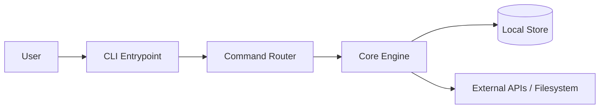
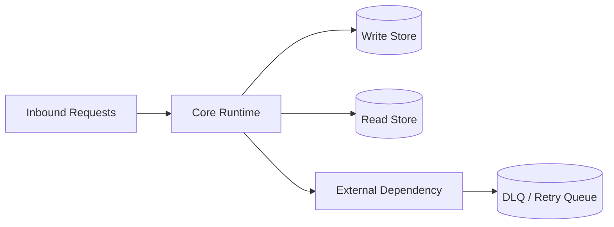
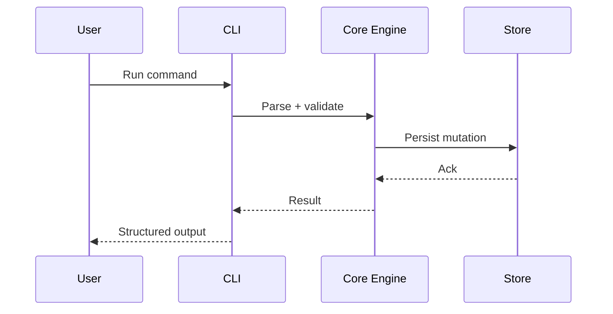
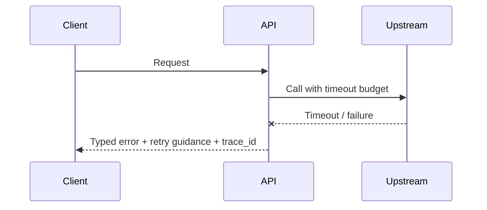

# Architecture

## Direction
cli

## What This Project Is
Decapod is a daemonless, local-first governance kernel for AI coding agents. Its architecture centers on an explicit control plane: agents call Decapod to refine intent, resolve context, claim exclusive work, generate living specs, execute inside isolated workspaces, and emit proof before promotion.

Architectural principles:
- **Daemonless invocation**: Decapod should run only when invoked and must not require a background service to enforce governance.
- **Local-first authority**: The repository carries the operational truth under `.decapod/`; external systems may reference work but do not replace Decapod's coordination state.
- **Generated architecture custody**: Generated specs are the agent-facing architecture map. They should be refreshed from current repo facts instead of relying on a stale manually maintained design note.
- **Explicit boundaries**: CLI/RPC contracts, store ownership, validation gates, workspace isolation, and proof artifacts are separate surfaces with documented responsibilities.
- **Proof before promotion**: Completion claims are only credible when validation gates and artifacts support them.

## Current Facts
- Runtime/languages: Rust
- Detected surfaces/framework hints: cargo
- Product type: cli

## Architecture Map
This project's architecture consists of several interconnected subsystems:
1. **CLI Layer** (`src/cli.rs`): Defines command-line interface and argument parsing for all Decapod commands (init, todo, validate, proof, workspace, etc.).
2. **Core Runtime** (`src/core/`):
   - **Todo System** (`todo.rs`): SQLite-backed task management with claims, ownership, dependencies, and event journaling.
   - **Validation** (`validate.rs`): Intent-driven methodology validation harness with numerous gates (namespace purge, embedded self-contained, repo map, etc.).
   - **Proof** (`proof.rs`): Configurable proof execution from `proofs.toml` with health claim synchronization.
   - **Workspace** (`workspace.rs`): Git worktree and Docker container management for isolated agent workspaces.
   - **Constitution Access** (`assets.rs`): Embedded constitution retrieval and merging with project overrides (OVERRIDE.md).
   - **Specs Generation** (`project_specs.rs`): Scaffolding and manifest management for `.decapod/generated/specs/`.
   - **Storage** (`store.rs`, `db.rs`): Store abstraction and SQLite database access.
   - **Broker** (`broker.rs`): Audit log mutation broker with replay verification.
   - **Workunit** (`workunit.rs`): Work unit manifests linking tasks to specs, state, and proof.
   - **Plan Governance** (`plan_governance.rs`): Governed PLAN artifacts with state transitions.
   - **Context Capsules** (`context_capsule.rs`): Deterministic context resolution from embedded constitution.
   - **Obligation Graph** (`obligation.rs`): Obligation tracking for governance.
   - **Flight Recorder** (`flight_recorder.rs`): Timeline rendering from event logs.
3. **Plugins** (`src/plugins/`): Extensible subsystems (aptitude, federation, health, knowledge, policy, verify, workflow, etc.).
4. **Constitution** (`src/constitution/`): Core constitution nodes (core, interfaces, methodology, specs) re-exported via `src/constitution/core.rs`.
5. **Agent Interface**: Agent-facing documentation (AGENTS.md, CLAUDE.md, etc.) and the Universal Agent Contract (AGENTS.md) that mandates Decapod usage patterns.

## Generated Architecture Contract
Decapod-generated architecture documentation must be detailed enough for a new agent to orient without reading an external architecture note. It should describe:
- What the project is and what it is not.
- The control-plane entrypoints agents call and when those calls are required.
- Core subsystems, storage locations, and event journals.
- Data flows from agent invocation through CLI/RPC, core execution, persistence, validation, and proof emission.
- Current strongest primitives and the extension seams they imply.
- Known limitations, architectural risks, and traps to avoid.
- Candidate follow-up work as design issues, not hidden notes.

## Data Flows
- Agent → Decapod CLI → Core subsystems (todo, validate, proof, workspace, etc.) → `.decapod/` storage
- Constitution access via `assets.rs` → embedded JSON or merged with OVERRIDE.md
- Specs generated via `project_specs.rs` → `.decapod/generated/specs/`
- Workspaces created via `workspace.rs` → `.decapod/workspaces/` (git worktrees)
- Events journaled via todo and proof subsystems → `.decapod/data/todo.events.jsonl` and `proof.events.jsonl`

## Strongest Existing Primitives
1. **Constitution Access System**: The assets module provides robust, versioned access to embedded constitution documents with override capability via OVERRIDE.md. This is a mature, well-tested system for declarative governance.
2. **Todo Subsystem**: The todo.rs implementation features rich task properties (dependencies, blocking, ownership, claims, verification), event journaling for deterministic rebuild, and sophisticated claiming mechanisms for agent isolation.
3. **Validation Harness**: The validate.rs module implements a comprehensive, extensible validation suite with clear pass/fail/warn semantics and auto-remediation hints.
4. **Workspace Isolation**: The workspace.rs module provides sophisticated git worktree management with branch protection, containerization support, and todo-scoped branch naming.
5. **Specs as Living Contracts**: The project_specs.rs system (and scaffold.rs/validate.rs modules) creates a feedback loop between generated specs and user intent, featuring manifest-based change detection, automatic validation-driven refresh, and customization preservation that allows agents to enhance specs with project changes without losing manual edits.
6. **Proof System**: The proof.rs module enables configurable, auditable proof execution with health claim synchronization and event logging.
7. **Embedded Agent Contract**: The AGENTS.md file (and templates in assets.rs) provides a comprehensive, machine-readable contract that agents must follow, reducing ambiguity.

## Topology

## Store Boundaries

## Happy Path Sequence

## Error Path

## Execution Path
- Ingress parse + validation:
- Policy/interlock checks:
- Core execution + persistence:
- Verification and artifact emission:

## Concurrency and Runtime Model
- Execution model:
- Isolation boundaries:
- Backpressure strategy:
- Shared state synchronization:

## Deployment Topology
- Runtime units:
- Region/zone model:
- Rollout strategy (blue/green/canary):
- Rollback trigger and blast-radius scope:

## Data and Contracts
- Inbound contracts (CLI/API/events):
- Outbound dependencies (datastores/queues/external APIs):
- Data ownership boundaries:
- Schema evolution + migration policy:

## ADR Register
| ADR | Title | Status | Rationale | Date |
|---|---|---|---|---|
| ADR-001 | Initial topology choice | Proposed | Define first stable architecture | YYYY-MM-DD |

## Delivery Plan (first 3 slices)
- Slice 1 (ship first):
- Slice 2:
- Slice 3:

## Risks and Mitigations
| Risk | Likelihood | Impact | Mitigation |
|---|---|---|---|
| Contract drift across components | Medium | High | Spec + schema checks in CI |
| Runtime saturation under peak load | Medium | High | Capacity model + load tests |
