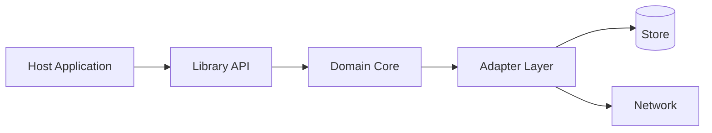
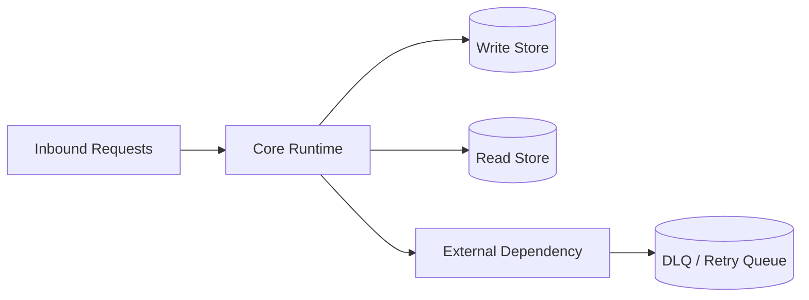
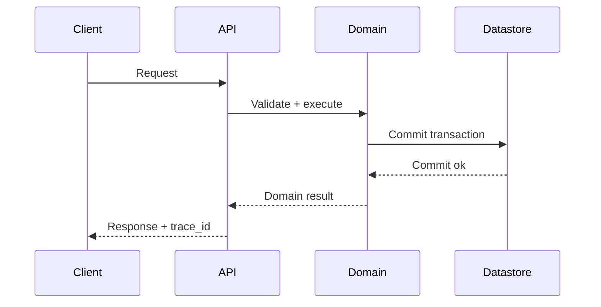
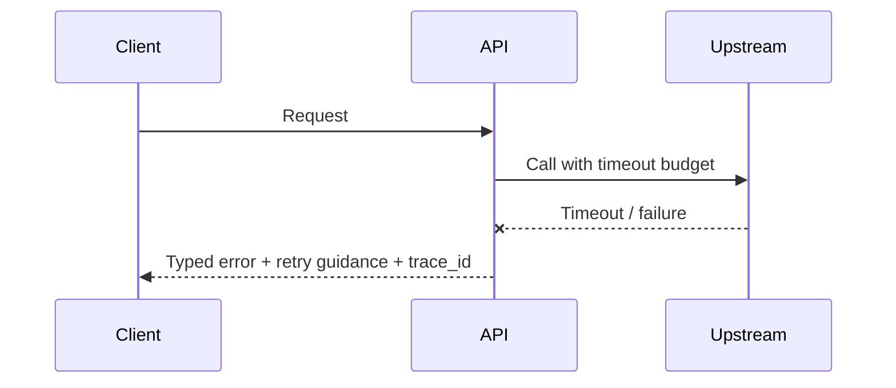

# Architecture

## Direction
Decapod is an on-demand control-plane runtime. It enforces workflow invariants around workspace isolation, task state transitions, and proof-backed completion while preserving deterministic local-first state.

## Current Facts
- Runtime/languages: rust
- Detected surfaces/framework hints: cargo
- Product type: service_or_library

## Topology

## Store Boundaries

## Happy Path Sequence

## Error Path

## Execution Path
- Ingress parse + validation:
- Policy/interlock checks:
- Core execution + persistence:
- Verification and artifact emission:

## Concurrency and Runtime Model
- Execution model:
- Isolation boundaries:
- Backpressure strategy:
- Shared state synchronization:

## Deployment Topology
- Runtime units:
- Region/zone model:
- Rollout strategy (blue/green/canary):
- Rollback trigger and blast-radius scope:

## Data and Contracts
- Inbound contracts (CLI/API/events):
- Outbound dependencies (datastores/queues/external APIs):
- Data ownership boundaries:
- Schema evolution + migration policy:

## ADR Register
| ADR | Title | Status | Rationale | Date |
|---|---|---|---|---|
| ADR-001 | Initial topology choice | Proposed | Define first stable architecture | YYYY-MM-DD |

## Delivery Plan (first 3 slices)
- Slice 1 (ship first):
- Slice 2:
- Slice 3:

## Risks and Mitigations
| Risk | Likelihood | Impact | Mitigation |
|---|---|---|---|
| Contract drift across components | Medium | High | Spec + schema checks in CI |
| Runtime saturation under peak load | Medium | High | Capacity model + load tests |
