# Intent

## Product Outcome
Decapod is a daemonless, local-first control plane that AI coding agents call to synchronize tasks, acquire workspace isolation, deterministically resolve context, validate against repository policies, and verify proof before code promotion.

## What This Project Is
decapod is a CLI control-plane governance tool built using Rust.
It provides a local-first coordination database and rules engine to align concurrent agents with human intent and repository standards.

Key operating facts:
- **Primary languages**: Rust
- **Detected surfaces**: cargo CLI, SQLite database files

## Product View

```mermaid
flowchart TD
    A[Agent Input] --> B[Decapod CLI]
    B --> C[Todo Coordination Database]
    B --> D[Workspace Manager - Git/Docker]
    B --> E[Policy & Validation Engine]
    B --> F[Proof Execution & Verification]
    F --> G[CI/Promotion Gate]
```

## Scope
| Area | In Scope | Proof Surface |
|---|---|---|
| Todo Lifecycle | Claiming, dependency routing, event journals | `decapod todo` test suite |
| Workspace Isolation | Git worktrees and Docker sandboxes | `decapod workspace` test suite |
| Validation Gates | Strict local-first quality & namespace checks | `decapod validate` test suite |
| Proof-Gating | QA runbooks, health metrics and logs | `decapod qa verify` |

## Non-Goals
| Non-goal | How to falsify |
|---|---|
| Autocomplete / Code Generation | Providing code completion or LLM generation within the tool itself |
| Centralized SaaS platform | Requiring a hosted centralized daemon to orchestrate basic local operations |
| Language-specific compilers | Bundling compilers or runtimes for target languages (must use container or host) |

## Constraints
- **Daemonless Execution**: Must execute synchronously as CLI commands; no background daemon processes.
- **SQLite Storage**: All todo, presence, and event data stored locally under `.decapod/data/`.
- **Git Sandboxing**: Workspaces must utilize Git worktrees with specific naming conventions (`agent/<agent-name>/<task-id>`).

## Acceptance Criteria
- [x] All 190+ validation checks in `decapod validate` pass cleanly on a fresh init.
- [x] Compilation checks (`cargo clippy`, `cargo fmt`) pass on every commit.
- [x] Integration tests for workspaces and database migration execute within 30s.

## Epistemic Custody Fields

### Active Assumptions
- The host has a functional `git` installation (verified during init/validation).
- The agent has write access to the `.decapod/` directory.

### Confidence & Risk Level
- **Confidence**: High (Fully verified local coordination and sandbox flows).
- **Risk**: Low (Local isolation limits blast radius).

### Measured vs Inferred Facts
| Fact | Source (Provenance) | Type |
|---|---|---|
| Git is installed | `Command::new("git")` check | Measured |
| Isolated branch naming | `workspace::ensure` execution | Measured |

### Unresolved Contradictions
- None.

### Deferred Questions
- None.

### Stop Conditions
- Lock contention on SQLite database exceeding retry budget.
- Conflicting todo claims by another active agent session.

### Proof Required Before Completion
- Green suite run on cargo integration tests.
- Complete spec verification manifest generation.
