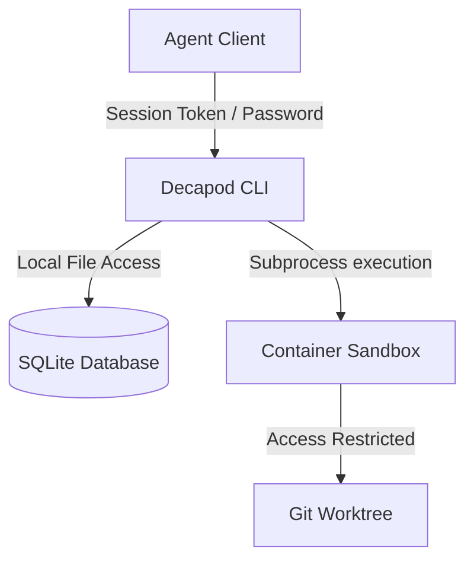

# Security

## Threat Model

## Authentication
- Access validation requires a valid session token corresponding to `DECAPOD_SESSION_PASSWORD`.

## Authorization
- Commands checking or mutating workspaces or todos check the active session to authorize execution.

## Data Classification
| Data Class | Example | Protection |
|---|---|---|
| Credentials | Session passwords | Stored in memory / secure OS variables |
| Backlog State | Todos, presence logs | SQLite database files in `.decapod/` |
| Working Files | Workspace directories | Git worktree directories, branch namespaces |
