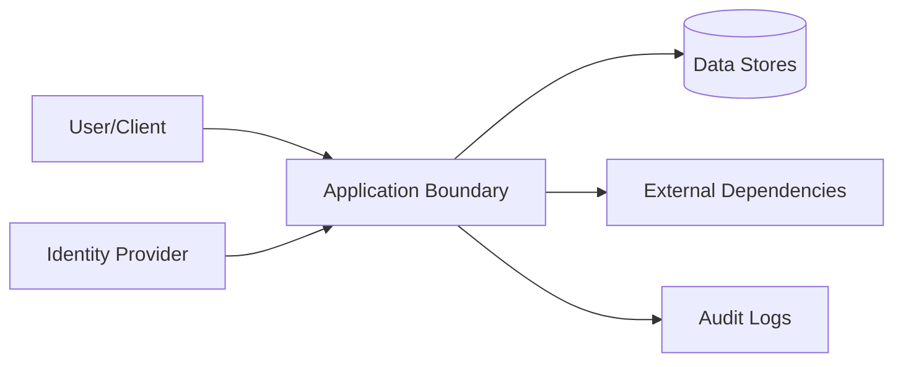

# Security

## Threat Model

## STRIDE Table
| Threat | Surface | Mitigation | Verification |
|---|---|---|---|
| Spoofing | Auth boundary | strong auth + token validation | auth tests |
| Tampering | State mutation APIs | integrity checks + RBAC | integration tests |
| Repudiation | Critical actions | immutable audit logs | log review |
| Information disclosure | Data at rest/in transit | encryption + classification | security scans |
| Denial of service | Hot paths | rate limit + backpressure | load tests |
| Elevation of privilege | Admin interfaces | least privilege + policy checks | authz tests |

## Authentication
- Identity source:
- Token/session lifetime:
- Rotation and revocation:

## Authorization
- Role model:
- Resource-level policy:
- Privilege escalation controls:

## Data Classification
| Data Class | Examples | Storage Rules | Access Rules |
|---|---|---|---|
| Public | docs, non-sensitive metadata | standard | unrestricted |
| Internal | operational telemetry | controlled | team access |
| Sensitive | tokens, PII, secrets | encrypted | least privilege |

## Sensitive Data Handling
- Encryption at rest:
- Encryption in transit:
- Redaction in logs:
- Retention + deletion policy:

## Supply Chain Security
- Recommended scanners: `cargo audit`, `cargo deny`, `cargo vet`
- Dependency update cadence:
- Signed artifact/provenance strategy:

## Secrets Management
| Secret | Source | Rotation | Consumer |
|---|---|---|---|
| External service auth material | managed runtime configuration | periodic | runtime services |
| Artifact signing material | managed signing service/local secure store | periodic | release pipeline |

## Security Testing
| Test Type | Cadence | Tooling |
|---|---|---|
| SAST | each PR | language linters/scanners |
| Dependency scan | each PR + weekly | supply-chain tools |
| DAST/pentest | scheduled | external/internal |

## Compliance and Audit
- Regulatory scope:
- Audit evidence location:
- Exception process:

## Pre-Promotion Security Checklist
- [ ] Threat model updated for changed surfaces.
- [ ] Auth/authz tests pass.
- [ ] Dependency vulnerability scan reviewed.
- [ ] No unresolved critical/high security findings.

## Strongest Security Primitives
1. **Constitution Access System**: The assets module provides robust, versioned access to embedded constitution documents with override capability via OVERRIDE.md. This is a mature, well-tested system for declarative governance.
2. **Proof System**: The proof.rs module enables configurable, auditable proof execution with health claim synchronization and event logging.
3. **Workspace Isolation**: The workspace.rs module provides sophisticated git worktree management with branch protection, containerization support, and todo-scoped branch naming.

## Generated Security Analysis
Generated security specs should document the active trust boundaries exposed by repository facts: local state stores, generated artifacts, session tokens, workspace paths, command execution surfaces, policy gates, proof artifacts, and any external service integrations. Security output must distinguish confirmed repo facts from inferred risks and leave unresolved questions visible for future agents.
