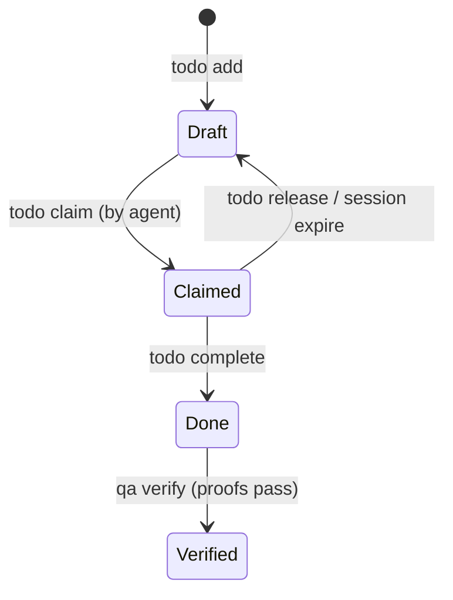
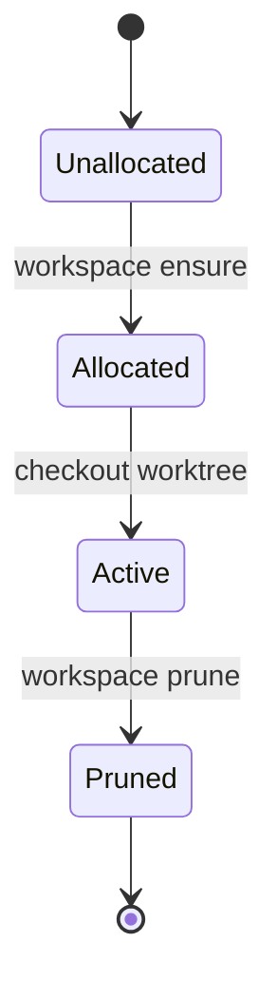

# Semantics

## State Machines

### Todo Lifecycle State Machine

### Workspace Lifecycle State Machine

## Invariants
| Invariant | Type | Validation |
|---|---|---|
| Single Active Claimant | Concurrency | SQLite database constraint (one active agent claim per todo ID) |
| Worktree Match | Filesystem | Worktree branch name must contain the claimed Todo ID |
| Verification Proof | Quality Gate | A todo cannot transit to `Verified` status without associated proof events passing |
| Unaltered Root checkout | Sandbox | Agent process is restricted to mutating files under `.decapod/workspaces/<worktree-name>` |

## Replay Semantics
- Todo mutations write log events to `.decapod/data/todo.events.jsonl`.
- Decapod can reconstruct the task board state deterministically by replaying these events sequentially.
- Replay conflicts (e.g. duplicate claims) are resolved using first-writer-wins database constraints.

## Idempotency Contracts
| Operation | Key | Duplicate Behavior |
|---|---|---|
| `todo claim` | todo_id + session_id | If session matches, return ok; if different session, return conflict error |
| `workspace ensure` | todo_id | Return existing worktree path and sync git changes |
| `specs.refresh` | manifest template hashes | Do not rewrite spec files if template content matches disk content |
