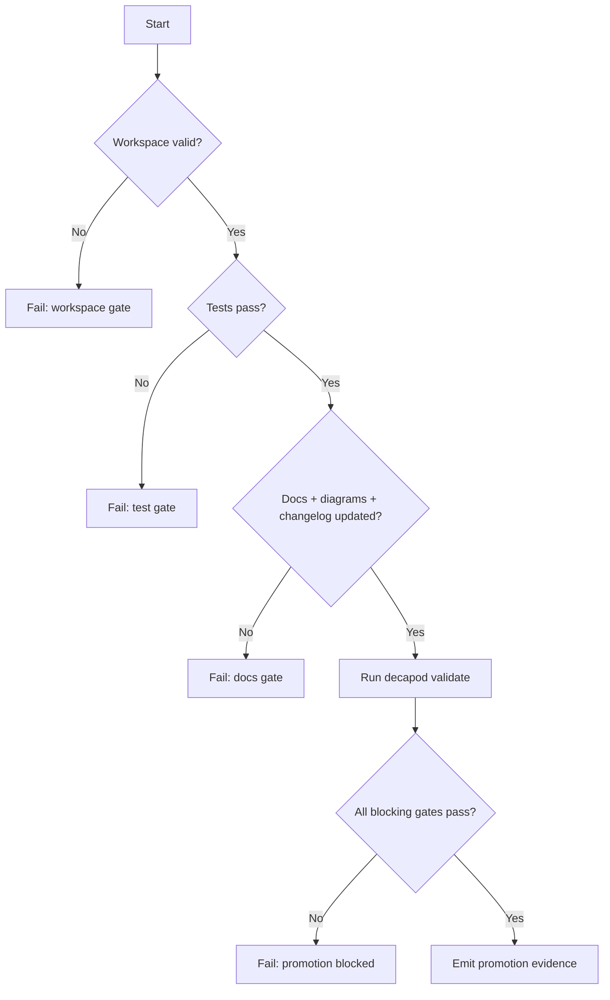

# Validation

## Validation Philosophy
> Validation is a release gate, not documentation theater.

## Validation Harness
The validate.rs module implements a comprehensive, extensible validation suite with clear pass/fail/warn semantics and auto-remediation hints. Key features include:
- **Methodology Gates**: Numerous validation gates enforce intent-driven development practices
- **Auto-Remediation Hints**: Provides specific guidance on how to fix validation failures
- **Workspace Enforcement**: Ensures agents work in isolated git worktrees or containers
- **Specs Integrity**: Validates that living specs match repository state
- **Proof Requirements**: Requires evidence artifacts for promotion gates
- **Constitution Integration**: Validates adherence to embedded constitution directives

## Generated Spec Refresh Gates
Decapod must keep generated specs synchronized at governance pressure points. When repository surfaces change, validation automatically refreshes and regenerates the spec templates inline and updates the manifest fingerprint and file hashes.

To ensure that hand-written enhancements are not lost, Decapod compares the disk hash of each spec file against its recorded template hash. If a spec file has been customized, its content is preserved on disk, and its updated content hash is stored in the manifest, allowing agents to continuously enrich specifications with relevant project details.

Refresh-capable paths:
- `decapod validate` (automatically refreshes specs on template version or fingerprint drift)
- `decapod rpc --op specs.refresh`
- initialization or scaffold refresh paths that regenerate `.decapod/generated/specs/*.md`

Refresh output requirements:
- Preserve hand-maintained customized spec files.
- Blend repo context into the existing canonical spec files.
- Update `.decapod/generated/specs/.manifest.json` after writing files.
- Avoid adding parallel project-state or architecture-survey documents outside the canonical spec set.

## Validation Decision Tree

## Promotion Flow

## Proof Surfaces
- `decapod validate`
- Required test commands:
- `cargo test`
- Required integration/e2e commands:

## Promotion Gates

## Blocking Gates
| Gate | Command | Evidence |
|---|---|---|
| Architecture + interface drift check | `decapod validate` | Gate output |
| Tests pass | project test command | CI + local logs |
| Docs + changelog current | repo docs checks | PR diff |
| Security critical checks pass | security scanner suite | scanner reports |

## Warning Gates
| Gate | Trigger | Follow-up SLA |
|---|---|---|
| Coverage regression warning | Coverage drops below target | 48h |
| Non-blocking perf drift | P95 regression below hard threshold | 72h |

## Evidence Artifacts
| Artifact | Path | Required For |
|---|---|---|
| Validation report | `.decapod/generated/artifacts/provenance/*` | Promotion |
| Test logs | CI artifact store | Promotion |
| Architecture diagram snapshot | `ARCHITECTURE.md` | Promotion |
| Changelog entry | `CHANGELOG.md` | Promotion |

## Regression Guardrails
- Baseline references:
- Statistical thresholds (if non-deterministic):
- Rollback criteria:

## Bounded Execution
| Operation | Timeout | Failure Mode |
|---|---|---|
| Validation | 30s | timeout or lock |
| Unit test suite | project-defined | non-zero exit |
| Integration suite | project-defined | non-zero exit |

## Coverage Checklist
- [ ] Unit tests cover critical branches.
- [ ] Integration tests cover key user flows.
- [ ] Failure-path tests cover retries/timeouts.
- [ ] Docs/diagram/changelog updates included.
