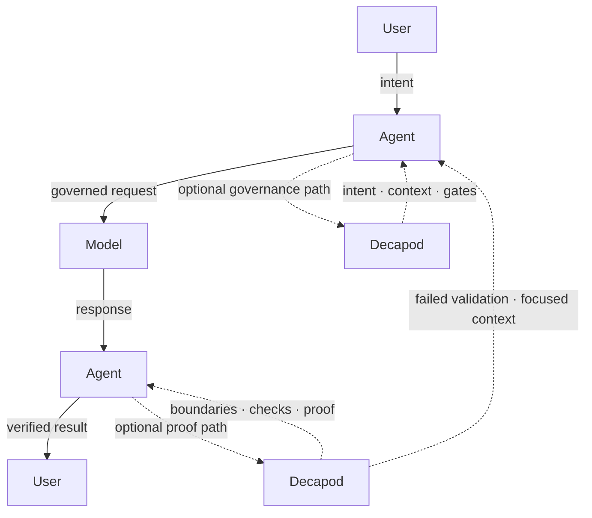

<p align="center">🦀</p>

<p align="center">
  <code>cargo install decapod && decapod init</code>
</p>

<p align="center">
  <strong>Decapod</strong><br />
  Daemonless, local-first governance kernel behind AI coding agents.
</p>

<p align="center">
  Agents call Decapod on demand to turn intent into context, then context into explicit specifications before inference,<br />
  enforce boundaries, and deliver proof-backed completion across concurrent multi-agent work.
</p>

<p align="center">
  <a href="https://github.com/DecapodLabs/decapod/actions"></a>
  <a href="https://crates.io/crates/decapod"></a>
  <a href="https://github.com/DecapodLabs/decapod/blob/master/LICENSE"></a>
</p>

Canonical Contract: [constitution/core/DECAPOD.md](constitution/core/DECAPOD.md)

---

## Get running

```bash
cargo install decapod
decapod init
```

`decapod init` creates `.decapod/`, a local folder your agent uses to remember intent, rules, context, specs, and proof.

Your **conversational** workflow does not change. You keep working through your agent; Decapod gives the agent the missing control plane. Intent is captured, scope is bounded, context is shaped, protected areas are respected, work is isolated, and completion is proven against the project’s rules and the Decapod constitution.

---

## How it works

AI coding agents often lose the plot: they forget intent, pull too much context, skip dependencies, and touch protected files. Decapod gives them a repo-native governance layer that makes intent explicit, boundaries enforceable, context deliberate, and completion provable.

### The Loop



Decapod is called by the agent at governance boundaries. Before inference, the agent may branch into Decapod to shape intent, context, and gates. After inference, the agent may branch into Decapod when the work needs boundary checks, verification, proof, or another governed pass.

Each Decapod call may recurse until the work is shaped, bounded, and provable. Decapod is not the agent and not the model; it is the governance kernel the agent calls whenever work needs control.

Decapod is called before:

- **Acting** — clarify intent and generate specs
- **Inference** — resolve focused context capsules
- **Touching Code** — enforce boundaries and protected paths
- **Completing** — produce verification and proof

---

## Capabilities

1. **Clarifies intent** — Converts vague requests into explicit, versioned specifications.
2. **Bounds context** — Resolves only the minimal relevant code/docs for the task.
3. **Enforces boundaries** — Safeguards protected branches and sensitive modules.
4. **Governs adaptation** — Manages feedback-driven instruction changes through explicit review.
5. **Requires proof** — Gates completion on deterministic verification artifacts.

---

## The substrate

Decapod preserves what agent workbenches lose: reusable, repo-native knowledge that survives the session.

```text
.decapod/
  generated/
    specs/         # Human-visible intent and architecture specs
    context/       # Deterministic context capsules
    artifacts/     # Verification output and proof provenance
  data/            # Durable repo-native state (DBs, events, todos)
  config.toml      # Project shape and agent-facing configuration
  OVERRIDE.md      # Local rules that override embedded defaults
```

Every run leaves operational evidence. The generated files are the human-visible proof surface: inspect them locally, review them in PRs, and use them to re-establish state across different agents like Claude, Codex, Gemini, Cursor, and Kilo.

---

## The constitution

Decapod ships with an embedded engineering constitution: over 100 declarative documents covering architecture, security, performance, and testing.

Everything an engineering org usually keeps in tribal memory or review culture becomes executable guidance. Your agent does not guess; it reads the constitution, cites claim IDs, follows gates, and produces proof.

---

## Guarantees

- **Daemonless** — Runs on demand like `git` or `grep`.
- **Repo-native** — All state lives in your repository.
- **Provider-agnostic** — Works across agent workbenches.
- **Proof-gated** — Completion requires passed verification gates.
- **Boundary-aware** — Enforces protected paths and branch isolation.

---

## Contributing

```bash
git clone https://github.com/DecapodLabs/decapod
cd decapod
cargo build && cargo test
```

- [CONTRIBUTING.md](CONTRIBUTING.md)
- [SECURITY.md](SECURITY.md)
- [Issues](https://github.com/DecapodLabs/decapod/issues)
